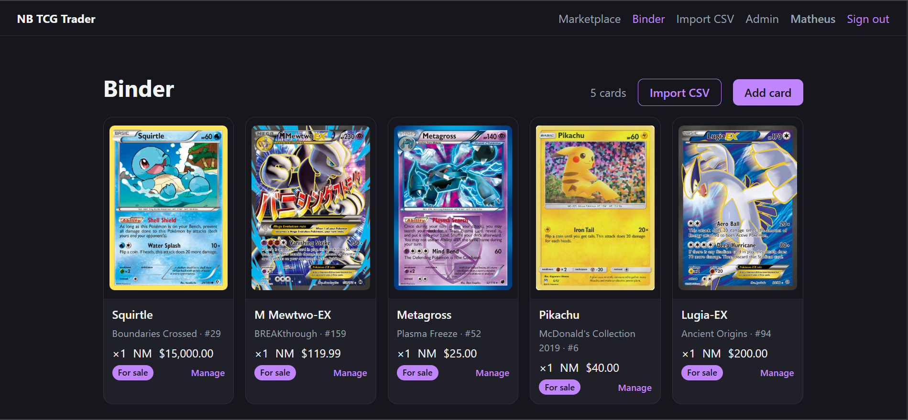
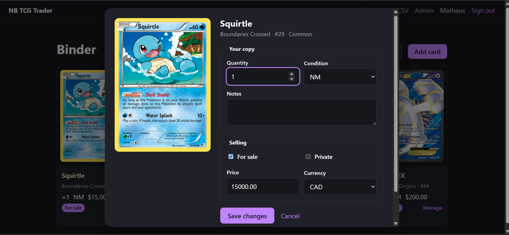
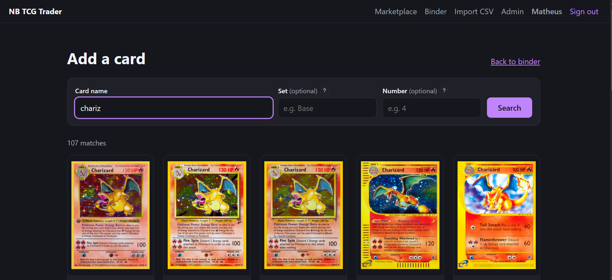
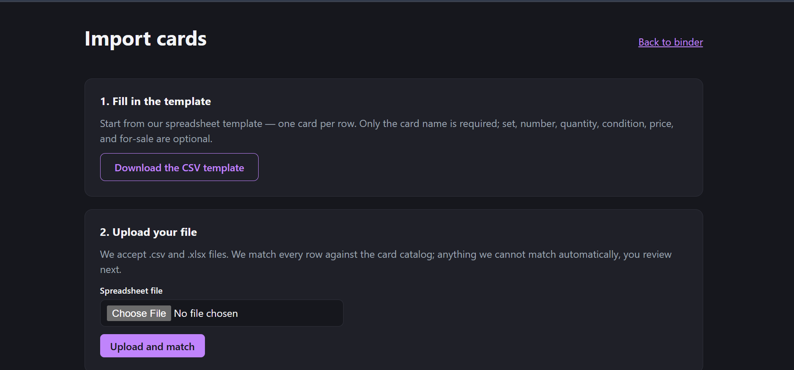
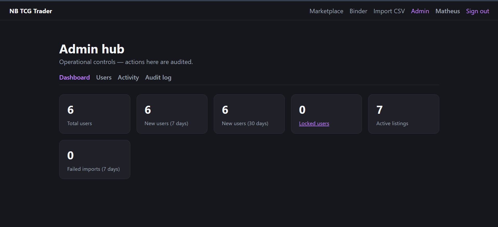

# NB TCG Trader

**A deployed full-stack trading-card marketplace and collection manager — ASP.NET Core (.NET 9), React + TypeScript, PostgreSQL — with a measured 33× faster marketplace browse query and a Testcontainers-backed integration test suite.**

[](https://github.com/MatheusFerraro/NB_TCG_Trader/actions/workflows/ci.yml)

**Live demo:** [nb-tcg-trader.vercel.app](https://nb-tcg-trader.vercel.app/)

NB TCG Trader lets collectors import Pokémon card collections from CSV/XLSX
files, reconcile fuzzy catalog matches, manage a visual binder, and publish
selected cards for local sale. It is localized for collectors in Moncton, NB,
Canada and Ipaussu, SP, Brazil, while the backend stays **TCG-agnostic** so Pokémon is supported first without hard-coding the schema against future games.

## Highlights

- **Deployed, production-style architecture** — React frontend on Vercel,
  containerized ASP.NET Core API on Azure Container Apps, managed PostgreSQL on
  Supabase, CI on GitHub Actions.
- **33× faster marketplace browse** — designed and benchmarked a PostgreSQL
  partial index over ~6k public listings, cutting the page-1 query from
  20.4 ms to 0.61 ms ([measurements](docs/perf-marketplace-browse.md)).
- **Typo-tolerant local catalog search** — moved search off an external API
  onto a locally seeded Postgres catalog with a `pg_trgm` GIN index and
  similarity ranking ([trade-offs](docs/perf-catalog-search.md)).
- **CSV/XLSX bulk import with reconciliation** — ambiguous rows are never
  silently dropped; the UI suggests ranked candidate cards backed by trigram
  similarity plus collector-number boosts.
- **Security by default** — rotating single-use refresh tokens, server-side
  ownership checks, role-gated admin with immutable audit log, rate limiting,
  CSV formula-injection protection, and a full git-history secret scan
  (139 commits, zero live secrets).
- **Real test pyramid** — fast in-process API tests, Testcontainers integration
  tests against real Postgres, and Vitest/Testing Library on the frontend, all
  split into separate CI jobs.

## Screenshots

| Binder | Manage a listing |
|---|---|
|  |  |

| Catalog search | Import flow |
|---|---|
|  |  |



## Tech Stack

| Area | Tools |
|---|---|
| Backend | .NET 9, ASP.NET Core Minimal APIs, EF Core, Npgsql |
| Frontend | React, TypeScript, Vite, React Router |
| Database | PostgreSQL on Supabase, EF Core migrations, `jsonb`, `pg_trgm` |
| Auth | ASP.NET Core Identity, JWT access tokens, rotating refresh tokens |
| Validation/errors | FluentValidation, ProblemDetails |
| Testing | xUnit, Shouldly, Testcontainers, Vitest, Testing Library |
| Cloud/DevOps | Docker, Azure Container Apps, Vercel, GitHub Actions |
| API docs/logging | Scalar/OpenAPI, Serilog |

## Architecture

Modular monolith with **vertical slices**: Auth, Catalog, Collection, Import,
Marketplace, and Admin. Each feature keeps its endpoint, handler, validation,
and DTOs together. The monolith is designed for later extraction into services,
but keeps the MVP simple and inexpensive to host.

```text
React + TypeScript (Vercel)
        │ HTTPS
        ▼
ASP.NET Core API (.NET 9, Docker, Azure Container Apps)
        ├── EF Core / Npgsql ──► PostgreSQL (Supabase, managed Postgres only)
        └── HttpClient ───────► pokemontcg.io / TCGdex-ready fallback seam
```

- Supabase supplies **only** the managed Postgres database. Auth is ASP.NET Core
  Identity inside the API; EF Core migrations own the schema.
- The data model is TCG-agnostic: `Game`, `CardSet`, `Card`, `CollectionItem`,
  `ImportJob`, and `ImportRow` are not Pokémon-only concepts.
- Catalog search runs locally in Postgres with seeded card data. External card
  APIs remain behind `ICardCatalogClient` for provider-backed lookups and
  future fallback work.

## Key Features

1. **Register / log in** — ASP.NET Core Identity with short-lived JWT access
   tokens and rotating refresh tokens.
2. **Import a collection** — upload `.csv` or `.xlsx` card lists using a
   downloadable template.
3. **Reconcile matches** — ambiguous rows are never dropped; the UI suggests
   ranked candidate cards that the user can pick or skip.
4. **Manage a binder** — visual card grid with quantity, condition, notes,
   private status, sale status, price, and currency.
5. **Browse marketplace listings** — the public marketplace query excludes
   private and not-for-sale binder items by construction.
6. **Contact the seller** — listing detail reveals only the seller's public
   contact handles: email, Discord, or Instagram.
7. **Admin hub** — role-gated dashboard, user management, lock/unlock workflow,
   coarse activity view, and immutable audit log.
8. **Verify an address / recover an account** — transactional email backs
   address confirmation and password reset; the reset revokes every existing
   session and notifies the account owner. See
   [Transactional email](#transactional-email).

## Transactional email

Address verification and password reset are backed by a swappable
`IEmailSender` behind a background outbox, so a slow provider never sits on a
request thread and a provider outage never fails a registration.

**Provider: [Resend](https://resend.com).** Chosen for the MVP because its free
tier covers this app's volume without a card on file, it authenticates domains
with SPF/DKIM, and it exposes a plain JSON API (no SMTP credentials to manage).

| | Free tier (as documented on issue #69) |
|---|---|
| Monthly cap | 3,000 emails |
| Daily cap | 100 emails |
| Account approval | Not required for the sandbox sender |
| Custom domain | Required to send from your own address; `onboarding@resend.dev` works for testing |
| Upgrade path | Paid tier lifts the caps; swapping to Brevo (300/day) or MailerSend (500/month) means one new `IEmailSender` and a config change — no slice touches the provider |

> Provider pricing moves. Re-check Resend's pricing page before relying on
> these numbers; they were taken from issue #69 and could not be re-verified
> from the build environment, which has no egress to `resend.com`.

**Local development sends nothing.** The default `Email:Provider=FileDrop`
renders each message to `./sent-emails/*.html` (gitignored) instead of
delivering it — open the file and click the link to walk the whole flow with no
provider account and no risk of mailing a real person. `Email:Enabled=false` is
a separate kill switch that drops every message, for when the free quota runs
out; the endpoints keep answering normally either way.

Configuration lives under the `Email` section — see
[.env.example](.env.example). `Email:ApiKey` is a secret and comes only from
user-secrets or the environment.

| Endpoint | Purpose |
|---|---|
| `POST /auth/email/verify` | Confirm an address from the emailed link |
| `POST /auth/email/verify/resend` | Request a fresh confirmation link |
| `POST /auth/password/forgot` | Start a reset — always `202`, never reveals whether the account exists |
| `POST /auth/password/reset` | Complete the reset with the emailed token |

Tokens come from ASP.NET Core Identity's own providers: time-limited, bound to
the user's security stamp, and single-use. They are never logged. The three
`/email` and `/password` entry points that put a message in someone's inbox
carry a tighter rate limit (3 per 5 minutes) than the rest of the auth group.

Email confirmation is **not** enforced at sign-in in the MVP — an unconfirmed
user sees a nudge on their profile rather than a locked account.

## Engineering Depth

**Testing**

- Fast API suite covers validators, import matching/parsing, handlers, and
  in-process API hosts without opening a database.
- Integration suite uses Testcontainers with real Postgres for auth flows,
  ownership rules, import end-to-end, marketplace filters, admin lock/audit,
  and schema migration.
- Web tests cover the API client layer and core frontend behavior with Vitest
  and Testing Library.
- CI runs the API build with warnings as errors, fast API tests, Postgres
  integration tests, and web lint/test/build as separate jobs.

**Security**

- Identity password hashing; no hand-rolled password storage.
- Short-lived access tokens and rotating, single-use refresh tokens.
- Server-side ownership checks for binder items, imports, and profile data.
- Role-gated admin endpoints with audit logging.
- CORS restricted to known frontend origins; rate limits on auth/import
  endpoints, a tighter limit on the email-sending endpoints, plus a global
  per-IP cap.
- Password reset never reveals whether an account exists, revokes every
  outstanding refresh token, clears the lockout, and emails a security notice.
- ProblemDetails responses without raw stack traces.
- File upload allowlists, size caps, row caps, and CSV formula-injection
  protection for generated spreadsheet content.
- Environment variables and user-secrets for credentials; `.env.example`
  documents names without values. Full git-history scan with gitleaks
  (2026-07-08, 139 commits): **no live secrets in history** —
  see [.gitleaks.toml](.gitleaks.toml).

**Performance**

- Catalog search moved from provider-bound search to a locally seeded Postgres
  catalog: a `pg_trgm` GIN index with similarity ranking keeps the common
  search path local and typo-tolerant.
- Import reconciliation returns real `Card.Id` values only; the system never
  invents catalog data.
- Marketplace browse was measured with ~8k collection rows and ~6k public
  listings. A partial index over public listings in browse order removed the
  full-sort hot path: **20.4 ms → 0.61 ms** on the benchmark page-1 fetch.

See [docs/perf-catalog-search.md](docs/perf-catalog-search.md),
[docs/perf-marketplace-browse.md](docs/perf-marketplace-browse.md), and
[docs/adr-ai-semantic-card-search.md](docs/adr-ai-semantic-card-search.md) for
measurements and trade-offs.

## Development Workflow

Managed like a small professional product::

- GitHub issues and a Kanban board tracked scope, acceptance criteria, review
  feedback, deployment hardening, and phase-2 decisions.
- Feature work flowed through a `dev` branch, CI, pull requests, and review;
  Copilot review comments were triaged and applied, adjusted, or rejected
  based on project constraints.
- AI tools (Claude Code, Codex) assisted with code review, debugging, and
  planning — architecture, implementation decisions, and final review stayed
  developer-owned.

## What This Project Demonstrates

- Building and deploying a real full-stack application with a .NET backend and React frontend.
- Designing backend features around authentication, ownership rules, validation, testing, and performance.
- Making practical architecture trade-offs: modular monolith first, service extraction later if needed.
- Using cloud infrastructure and CI/CD in a cost-conscious way suitable for an MVP.

## Getting Started

Prerequisites: [.NET SDK 9](https://dotnet.microsoft.com/download), Node.js 20+,
and Docker.

```bash
# 1. Database + API in containers
docker compose up

# 2. Or run the API directly against the compose database
dotnet user-secrets set "Jwt:SigningKey" "$(openssl rand -base64 48)" --project src/NbTcgTrader.Api
dotnet run --project src/NbTcgTrader.Api

# 3. Frontend
cd web && npm install && npm run dev
```

In Development, the API applies EF migrations on startup and serves OpenAPI +
Scalar UI at `/scalar`. Health probe: `/health`.

## Running Tests

```bash
dotnet test --filter "Category!=Integration"  # fast suite, no Docker
dotnet test --filter "Category=Integration"   # Testcontainers + Postgres
dotnet test                                    # everything
cd web && npm test                             # Vitest
```

## Deployment Notes

Current deployment: API container on Azure Container Apps, frontend on Vercel,
database on Supabase Postgres.

Deployment guides:

- [Azure Container Apps API deployment](docs/deploy-azure-container-apps.md)
- [Vercel frontend deployment](docs/deploy-frontend-vercel.md)
- [Azure Static Web Apps notes](docs/deploy-azure-static-web-apps.md)

Production API environment checklist:

| Variable | Required | Notes |
|---|---|---|
| `ASPNETCORE_ENVIRONMENT` | yes | `Production` disables Scalar/OpenAPI surface and startup migrations, enables HSTS |
| `ConnectionStrings__Default` | yes | Supabase Postgres connection string, SSL required |
| `Jwt__SigningKey` | yes | At least 32 bytes, generated per environment; startup fails fast if weak/missing |
| `Jwt__Issuer` / `Jwt__Audience` | no | Non-secret defaults in `appsettings.json` |
| `Cors__AllowedOrigins__0` | yes | Deployed frontend origin; empty default means API locked down |
| `Catalog__PlaceholderImageUrl` | yes | Absolute URL to `/assets/card-placeholder.svg` on the deployed API |
| `CardApi__Key` | no | pokemontcg.io key, optional because local catalog serves the hot path |
| `Admin__SeedEmails` | no | Comma-separated emails granted the Admin role on startup |

Frontend build-time variable: `VITE_API_URL`, set to the deployed API origin
without a trailing slash.

Production migrations are applied as a deliberate deploy step before routing
traffic:

```bash
dotnet ef database update --project src/NbTcgTrader.Api
```

## Repository Layout

```text
src/NbTcgTrader.Api/     # ASP.NET Core Web API, feature slices under Features/
tests/NbTcgTrader.Tests/ # xUnit + Shouldly tests
web/                     # React + TypeScript frontend
docs/                    # Deployment, performance, security, and ADR notes
.github/workflows/       # CI workflow
```

## Detailed Docs

- [AGENTS.md](AGENTS.md) — project source of truth for scope, architecture,
  conventions, security, and workflow.
- [CLAUDE.md](CLAUDE.md) — additional working context and implementation notes.
- [BACKLOG.md](BACKLOG.md) — roadmap and issue mirror.
- [docs/security/session-storage.md](docs/security/session-storage.md) — browser
  token storage decision and migration path.

## About

Built by **Matheus Camilo Ferraro** — backend/.NET developer based in Moncton,
NB, Canada.

- GitHub: [github.com/MatheusFerraro](https://github.com/MatheusFerraro)
- LinkedIn: [linkedin.com/in/mcamiloferraro](https://www.linkedin.com/in/mcamiloferraro/)